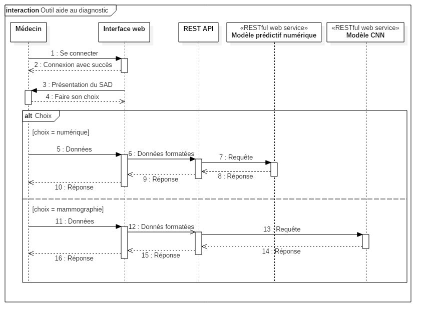
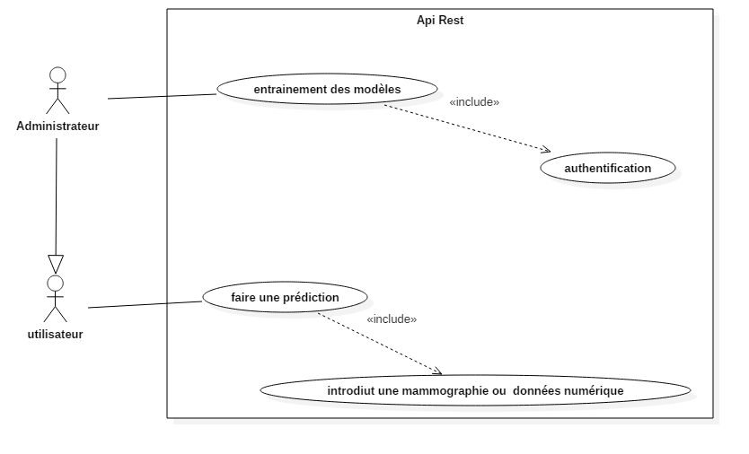
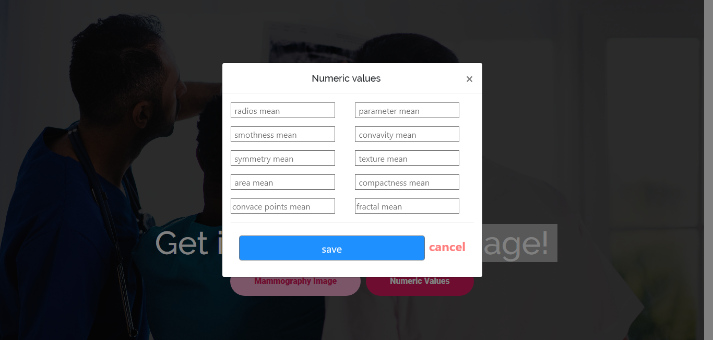
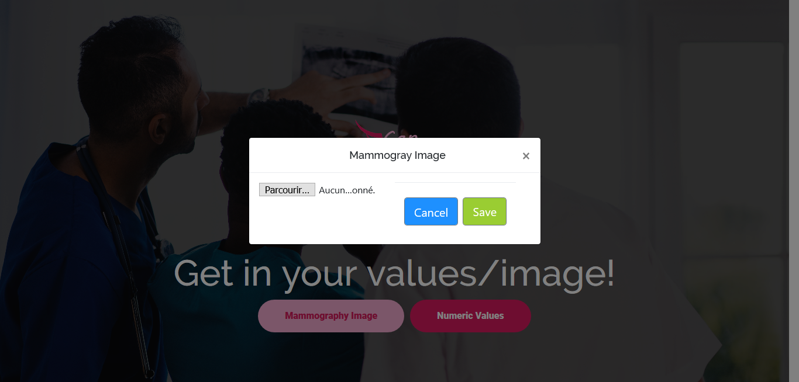
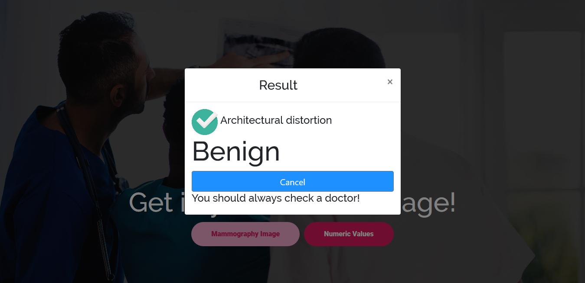

#  NCan-Api-Front-end

Front-end of rest full api to detection of breast cancer developed with  [Angular CLI](https://github.com/angular/angular-cli) version 7.3.3.
> **Note:** this project is linked with rest api.
## Introduction
In women, breast cancer remains the most common and deadliest cancer. Each year, there are nearly 1.38 million new cases and 458,000 deaths from breast cancer (IARC Globan, 2008). This type of cancer is widespread in both developed and developing countries. In Algeria, 12,000 new cases are registered each year.
In the vagueness that still surrounds the causes of this cancer, screening and early diagnosis remain the main means of fighting this disease. Breast cancer detected at an early stage can be controlled and treated. Conversely, if it is detected late, there is little chance that the curative treatment is really effective.
Mammography is the main radiographic examination for the detection and detection of tissue abnormalities. If the interest of this examination is undeniable, the interpretations and the follow-up to give to its results still debate. In fact, the question arises as to the first comment to be made, the need for a biopsy or the appropriate interval between two successive mammograms.
## Discription 
  
This project is the interface to query an API that contains predictive models (mammograms and digital data) to detect breast cancer

## Installing
You have to install Angular 7  this is link to help you : 
[https://angular.io/](https://angular.io/)

## structure
this project is divided in 4 composents :
<lu>
<li> Main</li>
<li> Header</li>
<li> Team</li>
<li> Footer</li>
</lu>

## UML Diagrams
### sequence diagram

This sequence diagram to show how this project intercat with Api

### Uses Cases diagram
This Uses Cases   diagram to show how you can use this application 

##  ergonomics
### home page : 

### digital values : 

### mammography image : 

### Result : 
	

## Contributors
<lu>
<li> SIDI MOHAMED HICHAM Zekri</li>
<li> GHILES Meddour</li>
<li> ANWAR Selmi</li>
<li> ZINEB Cherki</li>
</lu>
